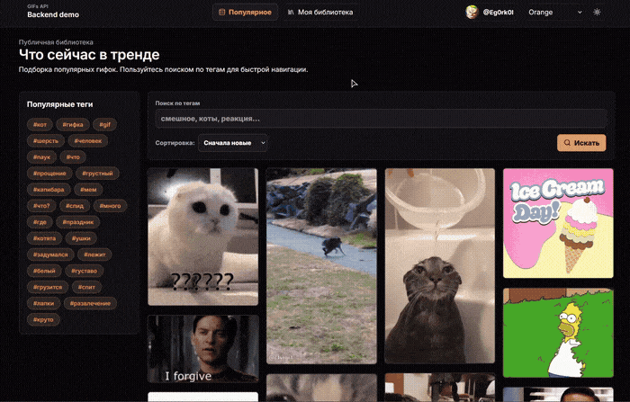
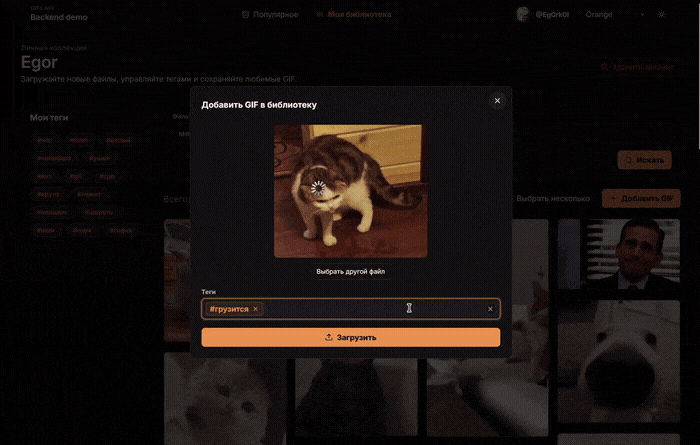
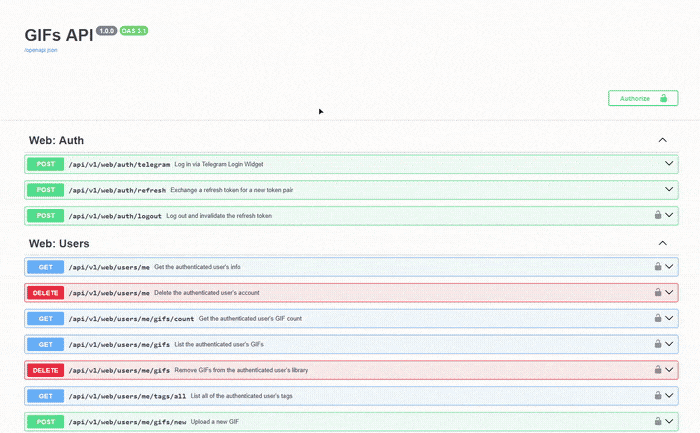
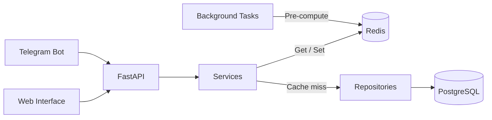
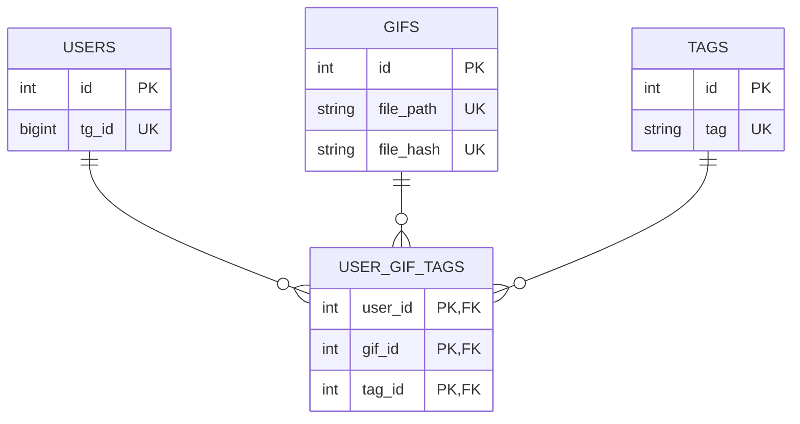

# 🚀 Async GIF Storage API

[](https://github.com/EgorBP/API/actions/workflows/ci.yml)

### 🔹 Описание

Асинхронное REST API, построенное на **FastAPI**, **PostgreSQL** и **Redis**. Проект реализует backend-сервис для хранения и управления GIF-файлами с использованием слоистой архитектуры, JWT-аутентификации, Redis-кэширования, фоновых задач, автоматизированного тестирования и CI.

---

### 🛠 Стек технологий

- **Language:** Python 3.13
- **Framework:** FastAPI, Pydantic v2
- **Database & ORM:** PostgreSQL, Async SQLAlchemy 2.0, Alembic
- **Caching:** Redis
- **Package Manager:** `uv`
- **Testing:** pytest, Testcontainers
- **CI/CD & DevOps:** GitHub Actions, Docker, Docker Compose

---

### 🎬 Демо

<details>
  <summary><b>Веб-интерфейс</b></summary>
    <p align="center">
      
      
    </p>
</details>

<details>
  <summary><b>Документация</b></summary>
    <p align="center">
      
    </p>
</details>

---

### 🏗 Архитектура

<details open>
  <summary><b>Архитектурная Mermaid-схема</b></summary>



</details>

<details>
  <summary><b>ER-диаграмма</b></summary>



</details>

---

### ✨ Основные возможности

- 🏗 **Слоистая архитектура:** Разделение на `Routers` → `Services` → `Repositories`, обеспечивающее изоляцию бизнес-логики, низкую связанность компонентов и удобство тестирования.
- 👥 **Мульти-клиентский API:** Независимые роутеры для веб-клиента (`/web`) и [Telegram-бота](https://github.com/EgorBP/TgGifBot) (`/bot`) с общей бизнес-логикой и отдельными механизмами авторизации.
- 🔐 **Аутентификация и авторизация:** JWT Access/Refresh Tokens с поддержкой **Refresh Token Rotation**, а также авторизация Telegram-бота через `X-Secret-Key`.
- 📁 **Работа с файлами:** Выделенный сервис хранения для загрузки, валидации, обработки и управления медиафайлами.
- ⚡ **Фоновые задачи:** Выполнение ресурсоёмких операций в асинхронном режиме без блокировки обработки HTTP-запросов.
- 📄 **Работа со списками данных:** Поддержка курсорной пагинации, фильтрации и сортировки для основных сущностей API.
- 🧠 **Redis-кэширование:** Кэширование GET-запросов с автоматической инвалидацией при изменении данных.
- 🗄 **Миграции базы данных:** Версионирование схемы PostgreSQL с помощью Alembic.
- 🪵 **Структурированное логирование:** Единый формат логов для удобной диагностики и анализа работы приложения.
- 🛡 **Обработка ошибок:** Централизованные Exception Handlers с единым форматом ответов API.
- 🛠 **Современный toolchain:** Управление зависимостями через `uv`, контейнеризация с Docker и автоматическая проверка проекта в GitHub Actions.
- 🧪 **Автоматизированное тестирование:** 173 асинхронных теста (Unit, Integration, Repository) с использованием `testcontainers`, автоматически поднимающих изолированные экземпляры PostgreSQL и Redis во время выполнения `pytest`.

 --- 
 
### 📦 Структура проекта

```text
├── .github/
│   ├── assets/              # GIF/MP4 для демонстрации в README
│   └── workflows/           # CI пайплайны GitHub Actions
├── backend/
│   ├── alembic/             # Миграции базы данных
│   ├── app/                 # Основной код приложения
│   │   ├── api/             # Эндпоинты, middleware, зависимости и handlers
│   │   ├── core/            # Settings, DB, Redis, Lifespan, Logging
│   │   ├── repositories/    # Слой работы с БД (SQLAlchemy)
│   │   ├── services/        # Бизнес-логика приложения
│   │   ├── tasks/           # Асинхронные фоновые задачи
│   │   └── utils/           # Вспомогательные модули
│   ├── tests/               # Unit, Integration и Repository тесты
│   ├── Dockerfile           # Сборка backend-контейнера
│   └── pyproject.toml       # Зависимости и настройки проекта
├── frontend/                # Web-интерфейс (Vite + Nginx)
├── envs/                    # Файлы окружения (.env)
├── docker-compose.yml       # Postgres + Redis → Migration → Backend → Frontend
└── README.md
```

---

## ⚙️ Запуск приложения

### 1. Клонирование проекта
```bash
git clone https://github.com/EgorBP/API.git
cd API
```

### 2. Настройка окружения
```bash
cp envs/.env.example .env
cp envs/.env.docker.example envs/.env.docker
```
> `DEV_MODE` позволяет создавать JWT токены через отдельный эндпоинт для любого Telegram ID пользователя и уменьшает время кеширования и вызова фоновых задач.   
> Для тестов `DEV_MODE` всегда false.
> 
> Для использования настоящей аутентификации через Telegram создайте своего бота в [`@BotFather`](https://telegram.me/BotFather), замените `BOT_TOKEN` на ваш токен и `BOT_NAME` на имя бота, затем задайте адрес вашего сайта в [`@BotFather`](https://telegram.me/BotFather) → `Login Widget`.

### 3. 🐳 Docker Compose
```bash
docker compose up --build
```
> Доступ к API: [`http://127.0.0.1:8000`](http://127.0.0.1:8000)    
> Сохраненные GIF: [`http://127.0.0.1/media/gifs/gif_filename`](http://127.0.0.1/media/gifs/) 
> 
> Swagger UI: [`http://127.0.0.1:8000/docs`](http://127.0.0.1:8000/docs)    
> ReDoc: [`http://127.0.0.1:8000/redoc`](http://127.0.0.1:8000/redoc)   

---

## 🧪 Тестирование

Проект содержит **173 асинхронных теста** (Unit, Integration, Repositories).   
Для запуска необходим работающий Docker. 

```bash
uv run pytest
```

> Благодаря `testcontainers` нужные контейнеры поднимаются и останавливаются автоматически.
